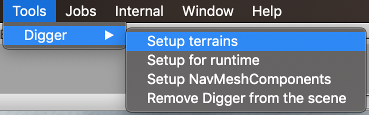
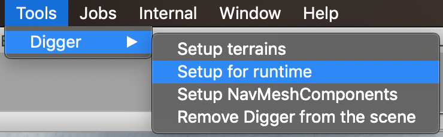

# Digger Documentation

Digger is a simple yet powerful tool to create natural caves and overhangs on your Unity terrains directly from the Unity editor.

There are two versions of Digger: **Digger** and **Digger PRO**.
Digger PRO has all the features of Digger plus realtime/in-game editing support.


## Support

To get support, please join us on **Discord**: https://discord.gg/C2X6C6s


## Download

Digger and Digger PRO can be downloaded from the [Asset Store](https://assetstore.unity.com/publishers/11530).


## Install

Digger is very easy to setup. Just download and import it from the Asset Store. **When Unity asks you if you want to install required packages, click *Yes*.**

From now on, Digger should be imported and **there should not be any error in the console**. There should be a new menu: *Tools > Digger*.


## Update

**Before importing a new version of Digger, please delete the Assets/Digger folder.** (but do **not** remove *DiggerData* folder)

Also, before updating Digger, it is recommended to backup your project (as with any asset update).

**After importing the new version, open Digger Master and click on *Sync & Refresh*.**


## Installation issues

If you get some errors after importing Digger, please check the following:

**First, make sure your project uses *.NET 4.x* as [shown here](https://docs.unity3d.com/2019.1/Documentation/Manual/ScriptingRuntimeUpgrade.html).**

Then, open the Package Manager (menu *Windows > Package Manager*).


Install the latest version of the packages `Mathematics` and `Burst`.

Delete Assets/Digger folder (if any) and import Digger into your project (from the Asset Store). **When Unity asks you if you want to install required packages, click *No*.**

Some users reported issues with the Package Manager after importing Digger. This is a Unity/Package Manager bug. Fortunately there is a simple workaround: when importing Digger, **unselect** the *Manifest.json* file from the import window.

From now on, Digger should be imported and **you should not have any error in the console**. There should be a new menu: *Tools > Digger*.

If you still have some issues, please join us on **Discord** so we can help you: https://discord.gg/C2X6C6s


## Getting Started

Open a scene with a terrain (you can open "simple-scene" in *Assets/Digger/Demo* for example) or create a terrain in a new scene. Configure your terrain layers as usual and modify your terrain as usual (raise or lower height, etc.). Make sure all your terrain layers have both a texture and a normal map.

Once this is done, click on *Tools > Digger > Setup terrains*. This will prepare Digger material, add Digger System to all terrains in the scene and add Digger Master object.



Click on Digger Master in the hierarchy of the scene to display the Digger Master inspector.


The Digger Master inspector looks like this:

 

To start digging, just click somewhere on your terrain!

Note: the first time you dig, Unity will freeze during a few seconds. This is because the Burst compiler needs to compile internal Digger jobs.


## Details of each field

### Edit tab
- **Action:** lets you choose the action to perform between digging terrain, raising overhangs, reseting (reset to terrain height but do not restore terrain details objects), or painting.
- **Brush:** lets you choose the brush type to use between sphere, cube and stalagmite.
- **Brush Size:** the size of the brush.
- **Opacity:** the speed at which you will dig/add mater to the terrain. This has no effect on reset and paint actions.
- **Depth:** the depth from the surface where you want to perform the action. Useful to adjust the position of the brush relatively to the terrain surface.
- **List of textures:** lets you choose which texture to use.
- **Auto-remove terrain details:** enable this to remove grass and details objects  automatically while you dig. Note: this cannot be undone!
- **Persist in Play Mode:** enable this to persist modifications that are done while the game is playing. This is generally what you want but if you want to test the DiggerRuntimeMaster in the editor, you will have to disable it.
- **Save Meshes as Assets:** all meshes generated by Digger are saved as assets in your projects. This makes the scene file a lot smaller and will spead up loading.
- **Sync with terrain(s) & Refresh:** forces Digger to synchronize with terrains and recompute everything. You have to click on it after you changed terrain textures or terrain heights for example.
- **Clear:** this will clear all modifications you’ve made to the terrains with Digger, but it won’t restore terrain details objects. This cannot be undone.

### Settings tab
- **Scene data folder:** Digger will automatically persist data in `Assets/DiggerData/<scene-data-folder>`. By default, this is the name of the scene. You can change it if you want, but don’t forget to rename the directory as well.
- **Enable shortcuts:** Enable or disable Digger shortcuts.
- **Show underlying objects:** Enable this to reveal all the objects generated by Digger in the hierarchy.
- **Layer:** This is the layer you want to use for Digger-generated meshes.
- **Chunk Size:** This is the size of each mesh that will be generated by Digger. Lower it to improve edit speed. Increase it to reduce the number of meshes.
- **Resolution:** by default, Digger generates meshes that fit to terrain’s mesh, which is directly related to heightmap resolution (and terrain size), but you can tell Digger to use a finer resolution (respectively, 2 times, 4 times or 8 times the terrain’s mesh resolution) thanks to this parameter.
- **Enable Occlusion Culling:** Occlusion Culling is not very stable on some versions of Unity, and Unity throws some errors (while it shouldn't) when baking Occlusion Culling if some meshes have multiple materials for a single submesh. This is why it is disabled by default on Digger, but you can still enable it if you want. Note: this setting has no effect if DiggerMasterRuntime (Digger PRO only) is present in the scene as chunks are not static anymore in such case.
- **Create LODs:** when enabled, Digger will automatically create 3 LODs for each mesh. Recommended only if you don't plan to use Digger at runtime.
- **Screen Relative Transition Height of LODs:** adjust these sliders to tell at which distance from the camera the cave/overhangs meshes should switch between LODs.
The bigger it is, the closer you will have to be from the object to get the highly detailed mesh.
- **Collider LOD:** lets you change the Level Of Details of the collider mesh. If you want accurate collisions that fit exactly to the ground, set it to 0. If you want better performance and don’t mind to have a lower accuracy, increase it to 1 or 2.
- **Save Meshes as Assets:** all meshes generated by Digger are saved as assets in your projects. This makes the scene file a lot smaller and will spead up loading.
- **Sync with terrain(s) & Refresh:** forces Digger to synchronize with terrains and recompute everything. You have to click on it after you changed terrain textures or terrain heights for example.
- **Clear:** this will clear all modifications you’ve made to the terrains with Digger, but it won’t restore terrain details objects. This cannot be undone.

### Help tab

This tab contains a link to this documentation as well as Discord for support.

It also gives you a link to write a review on the Asset Store which is the best way to thank the developer! :)

### Shortcuts

If shorcuts are enabled (in settings tab), then you can:
- press B to change brush
- press N to change action
- use keypad + and - to change brush size
- use keypad * and / to change opacity

## Realtime / in-game editing (PRO only)

### Setup

Digger now supports realtime editing, at runtime. To enable Digger at runtime, you **must** add `DiggerMasterRuntime` component in your scene(s). The easiest way to do this is to click on *Tools > Digger > Setup for runtime* menu. This will add an empty GameObject in your scene named "Digger Master Runtime" with the `DiggerMasterRuntime` attached to it.



### Use

The `DiggerMasterRuntime` component doesn't do much by itself. You will have to use its methods from your own scripts in order to perform actions on the terrain at runtime.

#### Synchronous editing

To edit the terrain synchronously, use the *Modify* method of DiggerMasterRuntime. *Synchronously* means that once this method returns, everything has been done, the terrain have been modified, required meshes have been generated and mesh colliders have been updated. In other words, it *waits* for the modification to be completely done before returning.

The signature of the *Modify* method is:
```csharp
/// <summary>
/// Modify the terrain at runtime by performing the requested action.
/// </summary>
/// <param name="position">Position where you want to edit the terrain</param>
/// <param name="brush">Brush type</param>
/// <param name="action">Action type</param>
/// <param name="textureIndex">Index of the texture to be used (starting from 0 to 7). See DiggerMaster inspector to know what texture corresponds to an index.</param>
/// <param name="opacity">Strength/intensity of edit</param>
/// <param name="size">Size of edit</param>
/// <param name="removeDetails">Remove terrain details in range</param>
/// <param name="removeTreesInSphere">Remove terrain trees in range</param>
/// <param name="stalagmiteHeight">Height of stalagmite (only when Brush is stalagmite)</param>
/// <param name="stalagmiteUpsideDown">Defines if stalagmite is upside-down or not (only when Brush is stalagmite)</param>
public void Modify(Vector3 position, BrushType brush, ActionType action, int textureIndex, float opacity,
                   float size, bool removeDetails = true, bool removeTreesInSphere = true, float stalagmiteHeight = 8f, bool stalagmiteUpsideDown = false)
```

Here is an example showing how you could use it in your scripts:
```csharp
var diggerMasterRuntime = FindObjectOfType<DiggerMasterRuntime>();

if (DiggerPhysics.Raycast(transform.position, transform.forward, out var hit, 2000f)) {
    diggerMasterRuntime.Modify(hit.point, BrushType.Sphere, ActionType.Dig, 0, 0.5f, 4f);
}
```

#### Asynchronous editing

To edit the terrain asynchronously, use the *ModifyAsync* or *ModifyAsyncBuffured* method of DiggerMasterRuntime. *Asynchronously* means that this method returns immediately without waiting for the modification to be actually done.

The signature of the *ModifyAsync* method is:

```csharp
/// <summary>
/// Modify the terrain at runtime by performing the requested action asynchronously to have less impact on frame rate.
/// It is NOT possible to call this method if another asynchronous modification is already in progress.
/// Use "IsRunningAsync" property to check if an asynchronous modification is already in progress.
/// </summary>
/// <param name="position">Position where you want to edit the terrain</param>
/// <param name="brush">Brush type</param>
/// <param name="action">Action type</param>
/// <param name="textureIndex">Index of the texture to be used (starting from 0 to 7). See DiggerMaster inspector to know what texture corresponds to an index.</param>
/// <param name="opacity">Strength/intensity of edit</param>
/// <param name="size">Size of edit</param>
/// <param name="removeDetails">Remove terrain details in range. Note: starting from Unity 2019.3 this parameter is ignored and details are always removed.</param>
/// <param name="removeTreesInSphere">Remove terrain trees in range</param>
/// <param name="stalagmiteHeight">Height of stalagmite (only when Brush is stalagmite)</param>
/// <param name="stalagmiteUpsideDown">Defines if stalagmite is upside-down or not (only when Brush is stalagmite)</param>
/// <param name="opacityIsTarget">If true when painting texture, the weight of the texture will be directly set to the given opacity</param>
public IEnumerator ModifyAsync(Vector3 position, BrushType brush, ActionType action, int textureIndex, float opacity,
                               float size, bool removeDetails = true, bool removeTreesInSphere = true, float stalagmiteHeight = 8f,
                               bool stalagmiteUpsideDown = false, bool opacityIsTarget = false)
```
**You MUST check that *IsRunningAsync* is *false* before calling this method. Also, you MUST call it as a Coroutine.**
This is why it is easier to use the *ModifyAsyncBuffured* method (see below).

The *ModifyAsyncBuffured* method appends the modification to a buffer so it can be performed asynchronously and takes care of the coroutine mess for you. It returns *true* if the modification could be appended to the buffer and *false* if the buffer was full and modification is discarded.

You can change the buffer size using the `BufferSize` property of DiggerMasterRuntime. By default, buffer size is 1.

The signature of the *ModifyAsyncBuffured* is:

```csharp
/// <summary>
/// Modify the terrain at runtime by performing the requested action asynchronously to have less impact on frame rate.
/// If another asynchronous modification is already in progress, this modification will be added to a buffer and will be performed later.
/// If the buffer is full, the modification is discarded and this method returns false.
/// </summary>
/// <returns>True if the modification could be appended to the buffer. False if the buffer is full and modification is discarded.</returns>
/// <param name="position">Position where you want to edit the terrain</param>
/// <param name="brush">Brush type</param>
/// <param name="action">Action type</param>
/// <param name="textureIndex">Index of the texture to be used (starting from 0 to 7). See DiggerMaster inspector to know what texture corresponds to an index.</param>
/// <param name="opacity">Strength/intensity of edit</param>
/// <param name="size">Size of edit</param>
/// <param name="removeDetails">Remove terrain details in range. Note: starting from Unity 2019.3 this parameter is ignored and details are always removed.</param>
/// <param name="removeTreesInSphere">Remove terrain trees in range</param>
/// <param name="stalagmiteHeight">Height of stalagmite (only when Brush is stalagmite)</param>
/// <param name="stalagmiteUpsideDown">Defines if stalagmite is upside-down or not (only when Brush is stalagmite)</param>
/// <param name="opacityIsTarget">If true when painting texture, the weight of the texture will be directly set to the given opacity</param>
public bool ModifyAsyncBuffured(Vector3 position, BrushType brush, ActionType action, int textureIndex, float opacity,
                                float size, bool removeDetails = true, bool removeTreesInSphere = true, float stalagmiteHeight = 8f,
                                bool stalagmiteUpsideDown = false, bool opacityIsTarget = false)
```

Here is an example showing how you could use it in your scripts:
```csharp
var diggerMasterRuntime = FindObjectOfType<DiggerMasterRuntime>();

if (DiggerPhysics.Raycast(transform.position, transform.forward, out var hit, 2000f)) {
    diggerMasterRuntime.ModifyAsyncBuffured(hit.point, BrushType.Sphere, ActionType.Dig, 0, 0.5f, 4f);
}
```

#### Persistence at runtime

To persist modifications at runtime, just call *PersistAll* method of DiggerMasterRuntime.
**Persistence must be enable in DiggerMasterRuntime inspector before building your project in order to be able to use it.**

Note: persistence methods have no effect in Unity editor.

Its signature is:
```csharp
/// <summary>
/// Persists all modifications made with Digger since the last persist call.
/// </summary>
public void PersistAll()
```

You can also delete persisted data:
```csharp
/// <summary>
/// Deletes all Digger data that was persisted at runtime.
/// </summary>
public void DeleteAllPersistedData()
```

And you can change the path at which data is written on disk:
```csharp
/// <summary>
/// When a path-prefix is specified, Digger will persist data at "Application.persistentDataPath/DiggerData/pathPrefix/".
/// Otherwise it will persist data at "Application.persistentDataPath/DiggerData/"
/// </summary>
/// <param name="pathPrefix"></param>
public void SetPersistenceDataPathPrefix(string pathPrefix)
```

#### Adding Digger to new terrains created at runtime

You may want to generate new terrains at runtime procedurally, and add Digger to them so the player can dig. Digger lets you do this easily, but you will have to have at least one pre-existing terrain (in Unity editor) so Digger can configure itself.

Once you create the new terrain, all you need is to call *SetupRuntimeTerrain* method of DiggerMasterRuntime:
```csharp
/// <summary>
/// Setups Digger on a new terrain that has been created at runtime.
/// There MUST be at least one other terrain with Digger already setup at edit-time.
/// </summary>
/// <param name="terrain">Terrain on which Digger must be added</param>
public void SetupRuntimeTerrain(Terrain terrain)
```

### Performance tips

Keep in mind that digging has a cost. To prevent performance issues at runtime, keep the brush size as small as possible. Also, try to call the *Modify* method at most one time per frame.

You can also improve performance by:
- using Unity 2019.3+
- lowering the size of chunks (set it to 16) in the Settings tab
- disabling LODs generation
- use async modification methods
- reducing the size of the terrain's control map (only if you use Unity 2019.2 o an older version)
- reducing the size of the terrain's heightmap
- if you have a big terrain, cut it in smaller chunks (ie. use multiple terrains instead of only one)

Note: if you are using CTS, Digger has to compute mesh tangents which slows down the build process.


## Realtime / in-game NavMesh update (PRO only)

### About NavMeshComponents

Digger PRO comes with a customized version of [NavMeshComponents](https://github.com/Unity-Technologies/NavMeshComponents) module.
This is the latest version of Unity's NavMeshComponents with only a few changes to make some C# methods public and usable from DiggerNavMeshRuntime script, which was needed for optimisation purpose.

The namespace has also been changed from *UnityEngine.AI* to *Digger.Navigation* to avoid any confict.

### Setup

To enable Digger NavMeshComponents at runtime, you **must** add `DiggerNavMeshRuntime` component in your scene(s). The easiest way to do this is to click on *Tools > Digger > Setup NavMeshComponents* menu. This will add the DiggerNavMeshRuntime component to the "Digger Master Runtime" object.

### Use

Digger NavMesh updater relies entirely on Unity's NavMeshSurface component. You should **NOT** bake any NavMesh using the classical AI > Navigation window because it will not be updated by Digger.

**First, you need at least one NavMeshSurface** in your scene as Digger entirely relies on it. See [NavMeshComponents documentation](https://github.com/Unity-Technologies/NavMeshComponents) and [NavMeshComponents Unity's tutorial](https://unity3d.com/fr/learn/tutorials/topics/navigation/navmeshsurface-component) for more information. You can also find some help by searching the web.

Once you added one or more NavMeshSurface to your scene, you can **bake** them before running your game so that when Digger will update the NavMesh it won't need to build it entirely.

Before baking your NavMeshSurfaces, **I strongly recommend to edit your terrains with Digger**, at least a little bit, even if you only want runtime editing. This may look quite surprising, but doing so will prevent the NavMesh from rebuilding the whole terrain the first time you dig with Digger.

You are now ready to use DiggerNavMeshRuntime.

The `DiggerNavMeshRuntime` component doesn't do much by itself. You will have to use its *CollectNavMeshSources* and *UpdateNavMeshAsync* methods from your own scripts in order to update the NavMesh at runtime.

The signature of *CollectNavMeshSources* method is:
```csharp
/// <summary>
/// Collects all NavMesh sources in the world. This should be called once, and only once, in the Start method of another MonoBehavior.
/// </summary>
public void CollectNavMeshSources()
```

This method collects all NavMesh sources in the world. This should be called once, in the Start method of another MonoBehavior.

The signatures of *UpdateNavMeshAsync* method are:
```csharp
/// <summary>
/// Incrementally and asynchronously updates the NavMesh. Call this when you want the NavMesh to be refreshed, but avoid calling this every frame
/// to limit the impact on performance.
/// </summary>
public void UpdateNavMeshAsync()
```
or
```csharp
/// <summary>
/// Incrementally and asynchronously updates the NavMesh. Call this when you want the NavMesh to be refreshed, but avoid calling this every frame
/// to limit the impact on performance.
/// </summary>
/// <param name="callback">Callback method to be invoked once NavMesh has been updated</param>
public void UpdateNavMeshAsync(Action callback)
```

This method incrementally and asynchronously updates the NavMesh. Call this when you want the NavMesh to be refreshed, but avoid calling this every frame to keep a good FPS. For example, if your player can dig continuously by holding the mouse button, you should update the NavMesh only once the player releases the mouse button.

Optionaly, you can pass a callback method as an argument. The callback will be called once the NavMesh has been refreshed.

## Integration with MicroSplat

MicroSplat is fuly supported by Digger. It is actually recommended to use MicroSplat with Digger to get best results. MicroSplat is one of the best terrain shader available for Unity.

You will need:
- [MicroSplat](https://assetstore.unity.com/packages/tools/terrain/microsplat-96478)
- [Triplanar module](https://assetstore.unity.com/packages/tools/terrain/microsplat-triplanar-uvs-96777)
- [Digger integration module](https://assetstore.unity.com/packages/tools/terrain/microsplat-digger-integration-162840)

## Integration with CTS

CTS (Complete Terrain Shaders) is partially supported by Digger, but as things stand, you won’t be able to change textures in caves or on overhangs. It will pick-up the terrain texture.


## Raycast with DiggerPhysics (not necessary with Unity 2019.3+)

Unless you use Unity 2019.3 (or more recent), Unity *Physics.Raycast* methods won’t work through cave entrances because they will hit the old terrain surface as if it was still there. To solve this issue, Digger provides equivalent Raycast methods through the script *DiggerPhysics*.

⇒ To make raycasts work properly on cave entrances, you must replace all *Physics.Raycast* methods with *DiggerPhysics.Raycast* equivalent (just replace "Physics" by "DiggerPhysics").

Digger also provides a tool that can replace all occurrences of Physics.Raycast with DiggerPhysics.Raycast in a script for you. To use it, right-click on the script file you want to update and click on *Digger > Convert Raycasts* as shown below.


## Troubleshooting

#### When I dig for the first time, it works, but as soon as I dig again, bad things happen!
Disable Burst Compilation from the Burst menu. Restart Unity, and try digging again. If this fixes your issue, it means Burst is doing something wrong on your platform.
In such case, you should report the bug to Unity.

#### When I do some raycasts, it still detects the terrain surface on holes. How can I do to raycast through terrain holes?
Until Unity releases official terrain holes feature, you have to use DiggerPhysics.Raycast method to solve this.

#### I changed the textures of my terrain, and now caves don’t blend with terrain properly because they still use the old textures.
Click on ‘Sync & Refresh’ button of the Digger Master inspector.

If that’s not enough, delete texture arrays belonging to the terrain in Assets/DiggerData/TextureArrays and click on ‘Sync & Refresh’ button of the Digger Master inspector. This will force Digger to recompute texture arrays.

#### I changed the heights of my terrain at some place, but Digger doesn’t see it.
Click on ‘Sync & Refresh’ button of the Digger Master inspector. If you already dig/add mater at this place, you will probably have to reset it using the reset brush.

#### What should I save when I backup my project?
Digger persists everything in Assets/DiggerData. If you save this folder, you’re fine.

Do NOT backup your project using only Export package feature of Unity, because it won’t keep internal Digger data that is put in “.internal” folders for each terrain (typically in Assets/DiggerData/<scene-name>/<guid>/.internal folders).

Instead, you have to copy paste your project folder manually.

#### I exported DiggerData folder using Export package feature of Unity, but it didn’t keep modifications made with Digger.
Internally, Digger persists voxel data in Assets/DiggerData/<scene-name>/<guid>/.internal folders which are not exported by Unity (Unity ignores folders starting with a dot). You’ll have to copy past it manually.

#### Digger meshes do not perfectly blend with the terrain in general.
There should not be any visual difference between the terrain and the meshes generated by Digger.
However, there are a few reasons why it might happen:
Lightmapping is enabled on the terrain. You should disable it from terrain settings as Digger doesn’t support it. Go to the [terrain settings](https://docs.unity3d.com/Manual/terrain-OtherSettings.html) and disable "Lightmap Static" toggle.
When the terrain is selected in the editor, it is looks more orange. Just unselect it.
In some particular cases, because ‘Draw instanced’ is enabled on your terrain. See below:

#### Digger meshes do not perfectly blend with the terrain at some places, in particularly on slopes.
This can happen with some textures on some parts of the terrain if you enabled ‘Draw instanced’ in the terrain’s settings. This is because terrain normal is a bit different when this is enabled, so it can interact with lights a bit differently, making Digger mesh distinguishable.

In most cases, this is not noticable (all screenshots on the Asset Store page have been made with a terrain where Draw instanced is enabled for example), but if you find that it is too visible, you can simply disable Draw instanced in the [terrain settings](https://docs.unity3d.com/Manual/terrain-OtherSettings.html).

#### When I get away from a place I dug, at a certain distance, I can see a thin dark border around Digger meshes.
Try to lower the *Pixel error* in [terrain settings](https://docs.unity3d.com/Manual/terrain-OtherSettings.html).

#### Some of the terrain textures are missing in Digger inspector, and they are not rendered on Digger meshes.
This happen when you have some terrain layers that don’t have a normal map. Digger requires all terrain layers to have a normal map.
See this page for more information about terrain layers: https://docs.unity3d.com/Manual/class-TerrainLayer.html


## F.A.Q

#### Does Digger support the built in navmesh system?
No, because the navmesh system will still think the terrain is there (it won’t take terrain holes into account).
We will have to wait for Unity 2019.3 and its official, clean, terrain *cut* feature for this.

#### Is this an extension to Unity's built-in terrain system or an entirely proprietary system?
It’s an extension of the Unity’s built in terrain system. Basically, it just cuts the terrain where needed and generate meshes for caves and overhangs. In the end, you get a Unity terrain + some meshes (with different LODs because Digger generates automatically different LODs for each mesh).

Transition between meshes and terrain is seamless because they basically use the “same” shader (actually two different versions of the same shader: one for the terrain and one for the meshes).

#### Can caves be altered/created at runtime? (AKA player terraforming)
No, only edit time. For real-time, you should get a full voxel terrain engine like Ultimate Terrains.

#### Does this affect collisions? Meaning I can walk my character in these holes and into the caves?
Yes it solves collision thanks to automatically generated triggers + collision meshes. At the end of the video (on Asset Store page), you can see some balls falling into the caves. There is no need to add anything to your objects to make it work.

However, to get Raycast working, you will have to use DiggerPhysics.Raycast method.

#### How can I do to make Raycast working through cave entrances?
Until official terrain hole/cut feature (coming in Unity 2019.3), you have to use the DiggerPhysics.Raycast method.

#### How to see the objects and meshes created by Digger from the hierarchy?
Find the *DiggerSystem* object which is a child of your Terrain. Select it. In the inspector GUI, enable *"Show debug data"*. Save the scene and reload it (close it and open it again or restart Unity).
You will now see all the objects, meshes and colliders as children of the *DiggerSystem* object.


## Support

To get support, join us on **Discord**: https://discord.gg/C2X6C6s

Latest version of this documentation can be found here: https://ofux.github.io/Digger-Documentation/

## About Unity 2019.3

Unity 2019.3 comes with a new feature allowing to cleanly cut holes in the terrain. However, it does **not** create cave meshes for you. This is why Digger is a perfect companion of this new feature.

Thanks to this new way to cut holes in the terrain surface, Digger has better performance, is more robust, works out of the box with NavMesh and works with Physics.Raycast (no need to use DiggerPhysics anymore).

This is why **it is recommended to use Unity 2019.3 with Digger or Digger PRO**.

## How to thank the developer?

If you like Digger, the best way to help the project is to write a review on the Asset Store.
Nothing makes me happier than a nice review!

Also, don't hesitate to share your feedback on Discord. It's important to improve the product.

That's all. Now go and enjoy digging your terrains!
