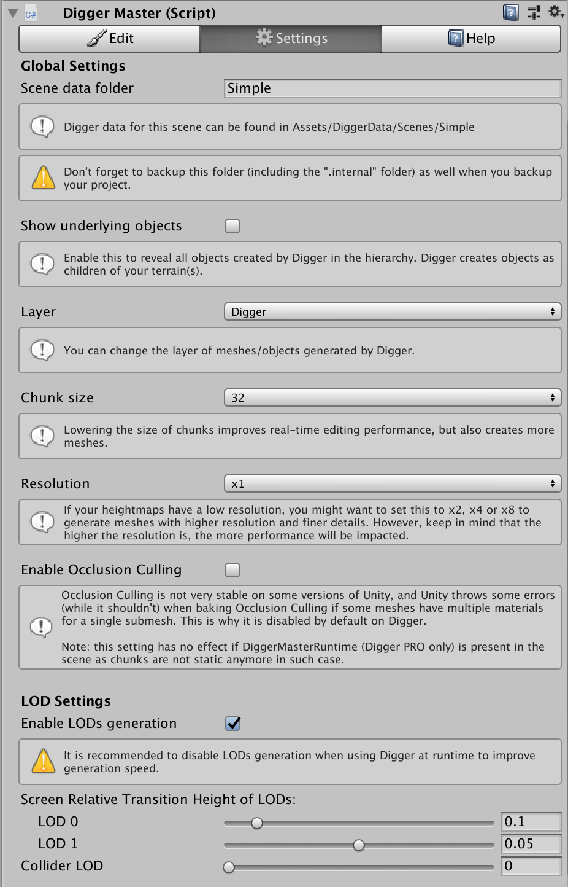

# Digger Documentation

## Introduction

Digger is a simple yet powerful tool to create natural caves and overhangs on your Unity terrains directly from the Unity editor.

There are two versions of Digger: **Digger** and **Digger PRO**.
Digger PRO has all the features of Digger plus realtime/in-game editing support.

### With this tool, you will be able to:
- Dig in your Unity terrain just like if it was a smooth voxel terrain.
- Create overhangs (the opposite of digging).
- Apply different textures on the overhangs, in the caves, etc.
- ***PRO only:*** Dig in real-time at runtime.

### However, you won't be able to:
- Generate caves procedurally. If you need this feature, you should get a full voxel-based terrain solution, like [Ultimate Terrains](https://assetstore.unity.com/packages/tools/terrain/ultimate-terrains-voxel-terrain-engine-31100).

### Get Digger
Digger and Digger PRO can be downloaded from the [Asset Store](https://assetstore.unity.com/publishers/11530).


## Getting Started

Digger is very easy to setup, but it requires you to install 3 packages.

**First, make sure your project uses *.NET 4.x* as [shown here](https://docs.unity3d.com/Manual/ScriptingRuntimeUpgrade.html).**

Then, open the Package Manager (menu *Windows > Package Manager*).


In the Package Manager window, click on "Advanced" and enable "Show preview packages".


Install the latest version of the packages `Mathematics`, `Collections` and `Burst`.

Then, import Digger into your project (from the Asset Store).

From now on, Digger should be imported and **you should not have any error in the console**. There should be a new menu: *Tools > Digger*.

**You are ready to use Digger.**

Open a scene with a terrain (you can open "simple-scene" in *Assets/Digger/Demo* for example) or create a terrain in a new scene. Configure your terrain layers as usual and modify your terrain as usual (raise or lower height, etc.). Make sure all your terrain layers have both a texture and a normal map.

Once this is done, click on *Tools > Digger > Setup terrains*. This will prepare texture arrays for Digger material, add Digger System to all terrains in the scene and add Digger Master object.


Click on Digger Master in the hierarchy of the scene to display the Digger Master inspector.


The Digger Master inspector looks like this:

 

To start digging, just click somewhere on your terrain!

Note: the first time you dig, Unity will freeze during about 1s. This is because the Burst compiler needs to compile internal Digger jobs.

### Details of each field

#### Edit tab
- **Action:** lets you choose the action to perform between digging terrain, raising overhangs, reseting (reset to terrain height but do not restore terrain details objects), or painting.
- **Brush:** lets you choose the brush type to use between sphere, cube and stalagmite.
- **Brush Size:** the size of the brush.
- **Opacity:** the speed at which you will dig/add mater to the terrain. This has no effect on reset and paint actions.
- **Depth:** the depth from the surface where you want to perform the action. Useful to adjust the position of the brush relatively to the terrain surface.
- **List of textures:** lets you choose which texture to use.
- **Auto-remove terrain details:** enable this to remove grass and details objects  automatically while you dig. Note: this cannot be undone!
- **Persist in Play Mode:** enable this to persist modifications that are done while the game is playing. This is generally what you want but if you want to test the DiggerRuntimeMaster in the editor, you will have to disable it.
- **Clear:** this will clear all modifications you’ve made to the terrains with Digger, but it won’t restore terrain details objects. This cannot be undone.
- **Sync & Refresh:** forces Digger to synchronize with terrains and recompute everything. This is useful if you changed terrain textures or heights.

#### Settings tab
- **Scene data folder:** Digger will automatically persist data in Assets/DiggerData/<scene-data-folder>. By default, this is the name of the scene. You can change it if you want, but don’t forget to rename the directory as well.
- **Chunk Size:** This is the size of each mesh that will be generated by Digger. Lower it to improve edit speed. Increase it to reduce the number of meshes.
- **Resolution:** by default, Digger generates meshes that fit to terrain’s mesh, which is directly related to heightmap resolution (and terrain size), but you can tell Digger to use a finer resolution (respectively, 2 times, 4 times or 8 times the terrain’s mesh resolution) thanks to this parameter.
- **Create LODs:** when enabled, Digger will automatically create 3 LODs for each mesh. Recommended only if you don't plan to use Digger at runtime.
- **Screen Relative Transition Height of LODs:** adjust these sliders to tell at which distance from the camera the cave/overhangs meshes should switch between LODs.
The bigger it is, the closer you will have to be from the object to get the highly detailed mesh.
- **Collider LOD:** lets you change the Level Of Details of the collider mesh. If you want accurate collisions that fit exactly to the ground, set it to 0. If you want better performance and don’t mind to have a lower accuracy, increase it to 1 or 2.
- **Clear:** this will clear all modifications you’ve made to the terrains with Digger, but it won’t restore terrain details objects. This cannot be undone.
- **Sync & Refresh:** forces Digger to synchronize with terrains and recompute everything. This is useful if you changed terrain textures or heights.

#### Help tab

This tab contains a link to this documentation as well as Discord for support.
**It also gives you a link to write a review on the Asset Store which is the best way to thank the developer! :)**


## Realtime / in-game editing (PRO only)

### Setup

Digger now supports realtime editing, at runtime. To enable Digger at runtime, you **must** add `DiggerMasterRuntime` component in your scene(s). The easiest way to do this is to click on *Tools > Digger > Setup for runtime* menu. This will add an empty GameObject in your scene named "Digger Master Runtime" with the `DiggerMasterRuntime` attached to it.


### Use

The `DiggerMasterRuntime` component doesn't do much by itself. You will have to use its *Modify* method from your own scripts in order to perform actions on the terrain at runtime.

The signature of *Modify* method is:
```csharp
/// <summary>
/// Modify the terrain at runtime by performing the requested action.
/// </summary>
/// <param name="position">Position where you want to edit the terrain</param>
/// <param name="brush">Brush type</param>
/// <param name="action">Action type</param>
/// <param name="textureIndex">Index of the texture to be used (starting from 0 to 7). See DiggerMaster inspector to know what texture corresponds to an index.</param>
/// <param name="opacity">Strength/intensity of edit</param>
/// <param name="size">Size of edit</param>
/// <param name="removeDetails">Remove terrain details in range</param>
/// <param name="removeTreesInSphere">Remove terrain trees in range</param>
/// <param name="stalagmiteHeight">Height of stalagmite (only when Brush is stalagmite)</param>
/// <param name="stalagmiteUpsideDown">Defines if stalagmite is upside-down or not (only when Brush is stalagmite)</param>
public void Modify(Vector3 position, BrushType brush, ActionType action, int textureIndex, float opacity,
                   float size, bool removeDetails = true, bool removeTreesInSphere = true, float stalagmiteHeight = 8f, bool stalagmiteUpsideDown = false)
```

And here is an example showing how you could use it in your scripts:
```csharp
var diggerMasterRuntime = FindObjectOfType<DiggerMasterRuntime>();

if (DiggerPhysics.Raycast(transform.position, transform.forward, out var hit, 2000f)) {
    diggerMasterRuntime.Modify(hit.point, BrushType.Sphere, ActionType.Dig, 0, 0.5f, 4f);
}
```

### Performance issues

Keep in mind that digging has a cost. To prevent performance issues at runtime, keep the brush size as small as possible. Also, try to call the *Modify* method at most one time per frame.

You can also improve performance by:
- lowering the size of chunks (set it to 16) in the Settings tab
- disabling LODs generation
- reducing the size of the terrain's control map
- reducing the size of the terrain's heightmap

Note: if you are using CTS, Digger has to compute mesh tangents which slows down the build process.


## Integration with CTS

CTS (Complete Terrain Shaders) is supported by Digger, but as things stand, you won’t be able to change textures in caves or on overhangs. It will pick-up the terrain texture. Future versions of CTS might allow to fix this.


## Upgrade guide

When a new version of Digger is released, you will probably want to install it. Just keep in mind that some updates might contain breaking changes that won't work with previous Digger saved data. In such case, it is clearly mentioned in the release note of the new version.

Follow these steps to upgrade your version of Digger:
- Completely backup your project (including **full copy-paste** of *DiggerData* folder and its *.internal* hidden folder)
- Remove *Digger* folder in Assets (but do **not** remove *DiggerData* folder)
- Import the new version
- Open you scene(s) and click on “Sync & Refresh” button


## Raycast with DiggerPhysics

Unity *Physics.Raycast* methods won’t work through cave entrances because they will hit the old terrain surface as if it was still there. To solve this issue, Digger provides equivalent Raycast methods through the script *DiggerPhysics*.

⇒ To make raycasts work properly on cave entrances, you must replace all *Physics.Raycast* methods with *DiggerPhysics.Raycast* equivalent (just replace "Physics" by "DiggerPhysics").

Digger also provides a tool that can replace all occurrences of Physics.Raycast with DiggerPhysics.Raycast in a script for you. To use it, right-click on the script file you want to update and click on *Digger > Convert Raycasts* as shown below.


## Troubleshooting

#### When I dig for the first time, it works, but as soon as I dig again, bad things happen!
Disable Burst Compilation from the Burst menu. Restart Unity, and try digging again. If this fixes your issue, it means Burst is doing something wrong on your platform.
In such case, you should report the bug to Unity.

#### Digger meshes are not rendered properly on Android / iOS
Digger requires OpenGL ES 3, so make sure OpenGL ES 2.0 is not used as Graphic API. To change the Graphic API used in your project, see this [article](https://support.unity3d.com/hc/en-us/articles/209004446-How-do-I-change-the-supported-Graphics-APIs-for-my-game-) and/or this [manual](https://docs.unity3d.com/Manual/GraphicsAPIs.html).

#### When I do some raycasts, it still detects the terrain surface on holes. How can I do to raycast through terrain holes?
Until Unity releases official terrain holes feature, you have to use DiggerPhysics.Raycast method to solve this.

#### I changed the textures of my terrain, and now caves don’t blend with terrain properly because they still use the old textures.
Click on ‘Sync & Refresh’ button of the Digger Master inspector.

If that’s not enough, delete texture arrays belonging to the terrain in Assets/DiggerData/TextureArrays and click on ‘Sync & Refresh’ button of the Digger Master inspector. This will force Digger to recompute texture arrays.

#### I changed the heights of my terrain at some place, but Digger doesn’t see it.
Click on ‘Sync & Refresh’ button of the Digger Master inspector. If you already dig/add mater at this place, you will probably have to reset it using the reset brush.

#### What should I save when I backup my project?
Digger persists everything in Assets/DiggerData. If you save this folder, you’re fine.

Do NOT backup your project using only Export package feature of Unity, because it won’t keep internal Digger data that is put in “.internal” folders for each terrain (typically in Assets/DiggerData/<scene-name>/<guid>/.internal folders).

Instead, you have to copy paste your project folder manually.

#### I exported DiggerData folder using Export package feature of Unity, but it didn’t keep modifications made with Digger.
Internally, Digger persists voxel data in Assets/DiggerData/<scene-name>/<guid>/.internal folders which are not exported by Unity (Unity ignores folders starting with a dot). You’ll have to copy past it manually.

#### Digger meshes do not perfectly blend with the terrain in general.
There should not be any visual difference between the terrain and the meshes generated by Digger.
However, there are a few reasons why it might happen:
Lightmapping is enabled on the terrain. You should disable it from terrain settings as Digger doesn’t support it. Go to the [terrain settings](https://docs.unity3d.com/Manual/terrain-OtherSettings.html) and disable "Lightmap Static" toggle.
When the terrain is selected in the editor, it is looks more orange. Just unselect it.
In some particular cases, because ‘Draw instanced’ is enabled on your terrain. See below:

#### Digger meshes do not perfectly blend with the terrain at some places, in particularly on slopes.
This can happen with some textures on some parts of the terrain if you enabled ‘Draw instanced’ in the terrain’s settings. This is because terrain normal is a bit different when this is enabled, so it can interact with lights a bit differently, making Digger mesh distinguishable.

In most cases, this is not noticable (all screenshots on the Asset Store page have been made with a terrain where Draw instanced is enabled for example), but if you find that it is too visible, you can simply disable Draw instanced in the [terrain settings](https://docs.unity3d.com/Manual/terrain-OtherSettings.html).

#### When I get away from a place I dug, at a certain distance, I can see a thin dark border around Digger meshes.
Try to lower the *Pixel error* in [terrain settings](https://docs.unity3d.com/Manual/terrain-OtherSettings.html).

#### Some of the terrain textures are missing in Digger inspector, and they are not rendered on Digger meshes.
This happen when you have some terrain layers that don’t have a normal map. Digger requires all terrain layers to have a normal map.
See this page for more information about terrain layers: https://docs.unity3d.com/Manual/class-TerrainLayer.html


## F.A.Q

#### Does Digger support the built in navmesh system?
No, because the navmesh system will still think the terrain is there (it won’t take terrain holes into account).
We will have to wait for Unity 2019.3 and its official, clean, terrain *cut* feature for this.

#### Is this an extension to Unity's built-in terrain system or an entirely proprietary system?
It’s an extension of the Unity’s built in terrain system. Basically, it just cuts the terrain where needed and generate meshes for caves and overhangs. In the end, you get a Unity terrain + some meshes (with different LODs because Digger generates automatically different LODs for each mesh).

Transition between meshes and terrain is seamless because they basically use the “same” shader (actually two different versions of the same shader: one for the terrain and one for the meshes).

#### Can caves be altered/created at runtime? (AKA player terraforming)
No, only edit time. For real-time, you should get a full voxel terrain engine like Ultimate Terrains.

#### Does this affect collisions? Meaning I can walk my character in these holes and into the caves?
Yes it solves collision thanks to automatically generated triggers + collision meshes. At the end of the video (on Asset Store page), you can see some balls falling into the caves. There is no need to add anything to your objects to make it work.

However, to get Raycast working, you will have to use DiggerPhysics.Raycast method.

#### How can I do to make Raycast working through cave entrances?
Until official terrain hole/cut feature (coming in Unity 2019.3), you have to use the DiggerPhysics.Raycast method.


## Support

To get support, join us on **Discord**: https://discord.gg/C2X6C6s

Latest version of this documentation can be found here: https://ofux.github.io/Digger-Documentation/

## About Unity 2019.3

Unity 2019.3 will come with a new feature allowing to cleanly cut holes in the terrain. However, it will **not** create cave meshes for you. This is why Digger will be a perfect companion of this new feature.

Thanks to this new way to cut holes in the terrain surface, Digger will have better performance, will be more robust, should work out of the box with NavMesh and will work with Physics.Raycast (no need to use DiggerPhysics anymore).

Note that Digger for Unity 2019.3 is still under development. Both **Digger** and **Digger PRO** will be compatible with Unity 2019.3.

## How to thank the developer?

If you like Digger, the best way to help the project is to write a review on the Asset Store.
Nothing makes me happier than a nice review!

Also, don't hesitate to share your feedback on Discord. It's important to improve the product.

That's all. Now go and enjoy digging your terrains!
